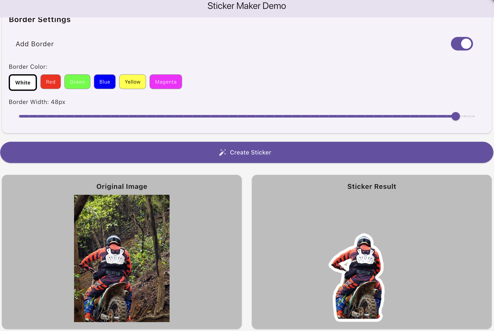

# Flutter Sticker Maker

A cross-platform Flutter plugin to create stickers by removing backgrounds from images using iOS Vision/CoreImage and ONNX.

## Features

- **High-quality detection**: Advanced ML models with preprocessing for better accuracy
- iOS: Uses Vision and CoreImage with enhanced quality settings and edge smoothing
- Android: Uses ONNX models for background removal on Android and iOS below iOS 17.0
- Configurable border support with customizable color and width
- Simple Dart API

## Quality Enhancements

- **Image preprocessing**: Automatic contrast and brightness enhancement
- **Edge smoothing**: Advanced algorithms to create natural-looking edges
- **Noise reduction**: Built-in filtering for cleaner results
- **High-resolution support**: Maintains image quality for large stickers

## Usage

```dart
import 'package:flutter_sticker_maker/flutter_sticker_maker.dart';

// Basic usage
final sticker = await FlutterStickerMaker.makeSticker(imageBytes);

// With border customization
final stickerWithBorder = await FlutterStickerMaker.makeSticker(
  imageBytes,
  addBorder: true,
  borderColor: '#FF0000', // Red border
  borderWidth: 15.0,      // 15 pixel border width
);
```

### Parameters

- `imageBytes`: The input image as Uint8List (PNG/JPEG)
- `addBorder`: Whether to add a border around the sticker (default: true)
- `borderColor`: Hex color string for the border (default: '#FFFFFF')
- `borderWidth`: Width of the border in pixels (default: 12.0)

## Examples

### Demo App Screenshots




See `example/` for a full demo app.

## Setup

- iOS: Minimum iOS 15.5
- Android: Minimum SDK 21

### Permissions

Add to AndroidManifest.xml:
```xml
<uses-permission android:name="android.permission.READ_MEDIA_IMAGES" />
<uses-permission android:name="android.permission.READ_EXTERNAL_STORAGE" android:maxSdkVersion="32"/>
<uses-permission android:name="android.permission.WRITE_EXTERNAL_STORAGE" android:maxSdkVersion="28"/>
<uses-permission android:name="android.permission.CAMERA" />
```

Add to ios/Runner/Info.plist:
```xml
<key>NSPhotoLibraryUsageDescription</key>
<string>This app needs access to your photo library to pick images and save stickers.</string>
<key>NSCameraUsageDescription</key>
<string>This app needs camera access to take pictures for sticker creation.</string>
<key>NSPhotoLibraryAddUsageDescription</key>
<string>This app saves stickers to your photo library.</string>
```

## Thanks

[image_background_remover](https://github.com/Netesh5/image_background_remover)
