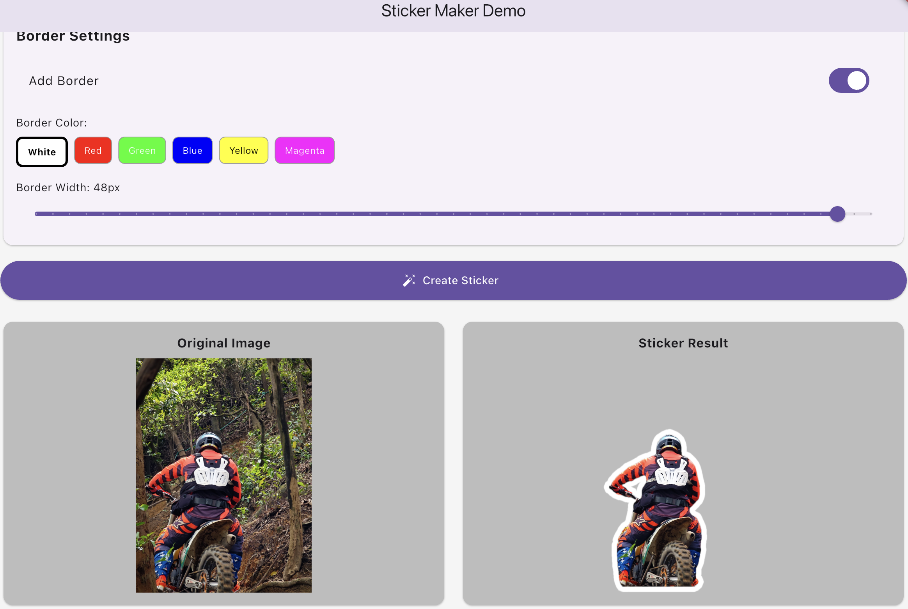

# Flutter Sticker Maker

A cross-platform Flutter plugin to create stickers by removing backgrounds from images using iOS Vision/CoreImage and ONNX.

## Features

- iOS 17.0: Uses Vision and CoreImage with enhanced quality settings and edge smoothing
- Android and iOS below 17.0: Uses **ONNX** models for background removal
- Configurable border support with customizable color and width
- Simple Dart API
- Multiple visual effect styles (Classic, Sparkle, Burst, Flutter Overlay) that mirror across Flutter and SwiftUI implementations

## Quality Enhancements

- **Image preprocessing**: Automatic contrast and brightness enhancement
- **Edge smoothing**: Advanced algorithms to create natural-looking edges
- **Noise reduction**: Built-in filtering for cleaner results
- **High-resolution support**: Maintains image quality for large stickers

## Performance Optimizations

- **Native FFI Processing**: High-performance C/C++ implementation for mask processing operations
- **SIMD Optimizations**: ARM NEON (Android) and Accelerate Framework (iOS) for vectorized operations
- **Optimized Algorithms**: Separable Gaussian blur (O(n) vs O(n²)) and efficient distance transforms
- **Memory Management**: Memory pooling and zero-copy operations to reduce allocation overhead
- **Expected Speedup**: 2-5x faster sticker creation with 30-50% less memory usage

The native FFI optimization automatically falls back to pure Dart implementation if the native library is unavailable, ensuring compatibility across all platforms.

## Usage

alternatively, you can initialize the plugin with the following code:

```dart
FlutterStickerMaker.initialize();
```

and dispose it when done:

```dart
FlutterStickerMaker.dispose();
```

make a sticker from an image:

```dart
import 'package:flutter_sticker_maker/flutter_sticker_maker.dart';

// Basic usage
final sticker = await FlutterStickerMaker.makeSticker(imageBytes);

// With border customization
final stickerWithBorder = await FlutterStickerMaker.makeSticker(
  imageBytes,
  addBorder: true,
  borderColor: '#FF0000', // Red border
  borderWidth: 15.0,      // 15 pixel border width
);

// With visual effect (native on iOS 17+)
final stickerWithEffect = await FlutterStickerMaker.makeSticker(
  imageBytes,
  showVisualEffect: true, // Shows animated preview overlay
  speckleType: SpeckleType.classic, // Choose overlay style (classic, sparkle, burst, cornerFlight, flutterOverlay)
);

// With Flutter overlay style on ONNX platforms (Android & older iOS)
final flutterOverlayPreview = await FlutterStickerMaker.makeSticker(
  imageBytes,
  showVisualEffect: true,
  speckleType: SpeckleType.flutterOverlay, // Flutter overlay style (ONNX platforms)
);

// With corner-flight overlay motion
final stickerToCorner = await FlutterStickerMaker.makeSticker(
  imageBytes,
  showVisualEffect: true,
  speckleType: SpeckleType.cornerFlight,
  flightCorner: StickerFlightCorner.bottomCenter,
);
```

### Parameters

- `imageBytes`: The input image as Uint8List (PNG/JPEG)
- `addBorder`: Whether to add a border around the sticker (default: true)
- `borderColor`: Hex color string for the border (default: '#FFFFFF')
- `borderWidth`: Width of the border in pixels (default: 12.0)
- `showVisualEffect`: Whether to show the visual effect overlay during processing (native SwiftUI on iOS 17+, Flutter overlay everywhere else, default: false)
- `speckleType`: Selects the overlay style (`SpeckleType.classic`, `sparkle`, `burst`, `cornerFlight`, or `flutterOverlay`). Defaults to classic. The `cornerFlight` style always uses the Flutter overlay so the processed sticker can animate toward a selected corner on every platform.
- `flightCorner`: Selects the destination position for `SpeckleType.cornerFlight`. Defaults to `StickerFlightCorner.topRight`. Available positions include the four corners plus `topCenter`, `centerLeft`, `centerRight`, and `bottomCenter`.
- `visualEffectBuilder`: Supply a `VisualEffectBuilder` to fully customize the
  overlay on every platform. The builder receives the source bytes and a
  `VisualEffectRequest` so you can await `request.processing`, call
  `request.dismiss()`, or keep the overlay visible after processing.

### Visual Effect Feature

When `showVisualEffect` is enabled:

- **iOS 17+ (Vision mode)** uses the native SwiftUI overlay with speckle emitters and mask reveal animation.
- **ONNX platforms (Android & older iOS)** now render a Flutter-based overlay with the same speckle styles, adaptive tinting, and sticker pop animation.
- The overlay automatically dismisses after processing finishes and gracefully falls back if no root overlay is available.
- Choose between `SpeckleType.classic`, `sparkle`, `burst`, `cornerFlight`, or `flutterOverlay`. The `cornerFlight` style animates the finished sticker toward a selected edge or corner with a scale-down motion and always uses the Flutter overlay implementation.
- Provide `visualEffectBuilder` when you need a custom progress or preview UI. It overrides the platform-specific overlays and gains direct control over when the overlay dismisses.

#### Custom Visual Effect Builder

```dart
final sticker = await FlutterStickerMaker.makeSticker(
  imageBytes,
  showVisualEffect: true, // optional when a builder is provided
  visualEffectBuilder: (context, request) {
    return ColoredBox(
      color: Colors.black54,
      child: Center(
        child: FutureBuilder<Uint8List?>(
          future: request.processing,
          builder: (context, snapshot) {
            if (snapshot.hasData) {
              // Keep overlay up for a manual preview, then dismiss.
              request.keepOverlayUntilDismissed();
              return GestureDetector(
                onTap: request.dismiss,
                child: Image.memory(snapshot.data!, fit: BoxFit.contain),
              );
            }
            return const CircularProgressIndicator.adaptive();
          },
        ),
      ),
    );
  },
);
```

On platforms where overlays cannot be drawn (e.g., headless tests), the request still completes without animation.

## Examples

### Demo App Screenshots



See `example/` for a full demo app.

## Setup

- iOS: Minimum iOS 16.0
- Android: Minimum SDK 24

### Permissions

Add to AndroidManifest.xml:

```xml
<uses-permission android:name="android.permission.READ_MEDIA_IMAGES" />
<uses-permission android:name="android.permission.READ_EXTERNAL_STORAGE" android:maxSdkVersion="32"/>
<uses-permission android:name="android.permission.WRITE_EXTERNAL_STORAGE" android:maxSdkVersion="28"/>
<uses-permission android:name="android.permission.CAMERA" />
```

Add to ios/Runner/Info.plist:

```xml
<key>NSPhotoLibraryUsageDescription</key>
<string>This app needs access to your photo library to pick images and save stickers.</string>
<key>NSCameraUsageDescription</key>
<string>This app needs camera access to take pictures for sticker creation.</string>
<key>NSPhotoLibraryAddUsageDescription</key>
<string>This app saves stickers to your photo library.</string>
```

## Thanks

Background removal: [image_background_remover](https://github.com/Netesh5/image_background_remover)

SpoilerView effect: [StickerViewExample](https://github.com/artemnovichkov/StickerViewExample)
